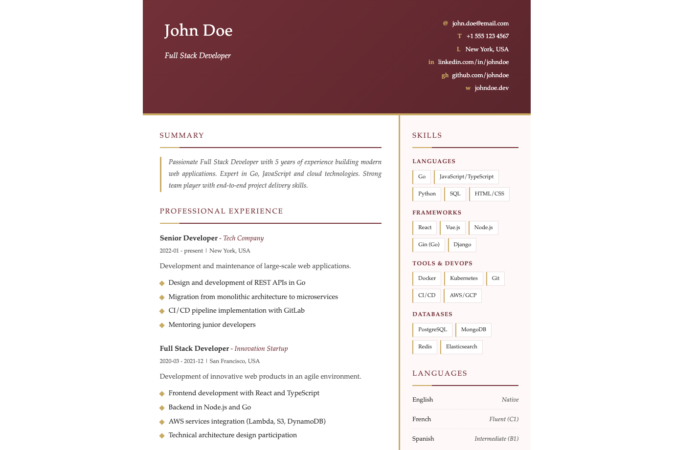

# Themes

## `elegant`

Use : `resumectl generate --theme elegant`

## `modern`

Use : `resumectl generate --theme modern`

## `classic`

Use : `resumectl generate --theme classic`

## `tech`

Use : `resumectl generate --theme tech`

